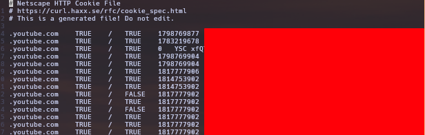
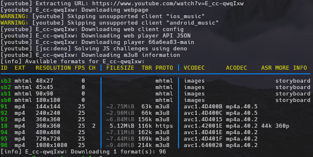

# Echo music-bot 

An attempt of me building a music bot using discord.js, distube, and ytdlp out of boredom

This is a self-hosted (currently private, but you can port one for yourself) Discord music bot built with `discord.js` and `DisTube`. 
Streams audio from YouTube via `yt-dlp`, with support for search, queue management, audio filters, looping, and lyrics lookup — all through slash commands.

> [!IMPORTANT]
> i will update the readme for installing and running as well mentioning what is the minimum prerequisite for the bot

### Features (for now)
 
- Play songs or playlists by search query or URL (`/play`, `/search`)
- Full queue management -> view, remove, play-next, skip, stop (`/queue`, `/remove`, `/playnext`, `/skip`, `/stop`)
- Playback controls -> pause, resume, seek, loop (`/pause`, `/resume`, `/seek`, `/loop`)
- Audio filters -> nightcore, vaporwave, bassboost, speed, 8D, and more (`/filter`)
- Lyrics lookup for the current or a searched track (`/lyrics`)
- Now-playing details (`/nowplaying`)
- Fully Dockerized for easy self-hosting

## Getting Started

### Prerequisites

- [Docker](https://www.docker.com/) and Docker Compose
- A Discord bot token ([Discord Developer Portal](https://discord.com/developers/applications))
- These are required if you are not building with docker
    - [Node.js](https://nodejs.org/en/download) minimum **v22.12** and NPM (or use NVM)
    - [FFMPEG](https://www.ffmpeg.org/download.html) (you can download it using your system package manager)
    - [yt-dlp](https://github.com/yt-dlp/yt-dlp/wiki/Installation)
    - [Deno](https://docs.deno.com/runtime/) (for the yt-dlp to be able to the solve YouTube's anti-bot JS challenges )

### Setup

1. Clone the repository
```bash
git clone https://github.com/lemodoescoding/musicbot.git
cd musicbot
```

2. Create an `.env` file in the project root with the content you can mirror from the `.env.example`
```bash
cp .env.example .env 
nano/vi/nvim/code .env
```
3. Add your YouTube cookies file (exported in Netscape format) to `cookies/master_cookies.txt` (you might create the `cookies` foler in the root of the project). This is used by `yt-dlp` to authenticate requests and access age/region-restricted content.
```bash
mkdir -p cookies
cp /path/of/your/cookie.txt cookies/master_cookies.txt
```

Cookie example is looking like this:
 

4. Build and run with Docker Compose
```bash
docker compose build --no-cache
docker compose up -d

# to see the logs
docker compose logs -f bot
```

### Running without docker

1. Install `ffmpeg`, `yt-dlp`, and `deno` on your system first. How the installation done is up to you
2. Add your YouTube cookies file (exported in Netscape format) to `/path/to/your/file/cookie.txt`. This is used by `yt-dlp` to authenticate requests and access age/region-restricted content.
Cookie example is looking like this:
 

3. Create a local yt-dlp config file on the `~/.config/yt-dlp/config` or run the following code snippet (change the path first!!!)
```bash
mkdir -p ~/.config/yt-dlp
cat > ~/.config/yt-dlp/config << 'EOF'
--remote-components ejs:github
--cookies /path/to/your/file/cookie.txt
--extractor-args "youtube:player_client=web_safari,web,ios_music,android_music" -f "bestaudio/best"
EOF
```
4. Verify the `yt-dlp` picks up the config we just made with this simulation provided by the yt-dlp
```bash
yt-dlp --simulate -F https://www.youtube.com/watch?v=E_cc-qwqIxw
```

It should prints something like image below if everything goes right


5. Install the dependencies of the project using npm
```bash
npm install
npm run prod
```

## How to get the cookie (using browser extension)

This will depends on what browser you have.
1. Install a browser extension to get the cookie in raw Netscape format, i have a few suggestion
    - Firefox : [cookies.txt](https://addons.mozilla.org/en-US/firefox/addon/cookies-txt/), [export-cookies](https://addons.mozilla.org/en-US/firefox/addon/export-cookies-txt/)
    - Chrome : [get-cookiestxt-locally](https://chromewebstore.google.com/detail/get-cookiestxt-locally/cclelndahbckbenkjhflpdbgdldlbecc)
    - Alternative : [convert-chrome-cookies-to-netscape-format](https://github.com/dandv/convert-chrome-cookies-to-netscape-format) (Github Repo)
2. Login to your dummy google account and log on to youtube (recommended to open it inside an incognito tab) and **DO NOT CLICK anything**
3. If using browser extension, refer to the documentation how to download the cookie in txt format or to export, if using the github repo alternative, follow the instruction on the README file
4. If you have downloaded the cookie in text format, close the browser tab and store the downloaded cookie somewhere in your system

## License

ISC
